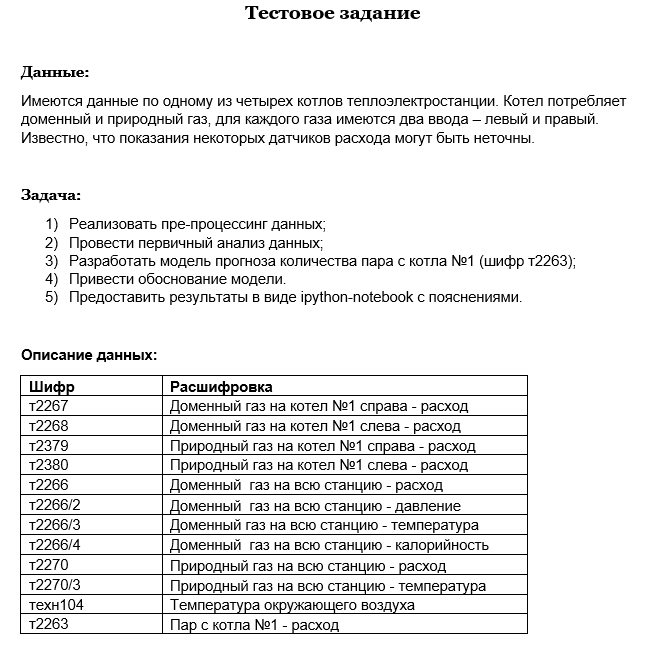
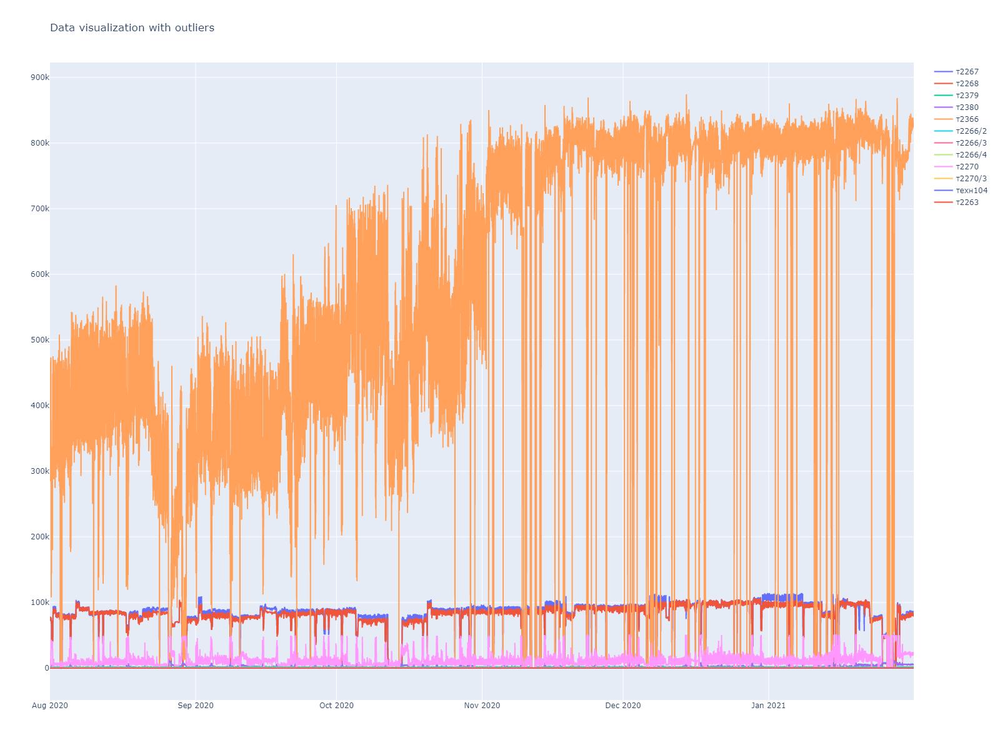
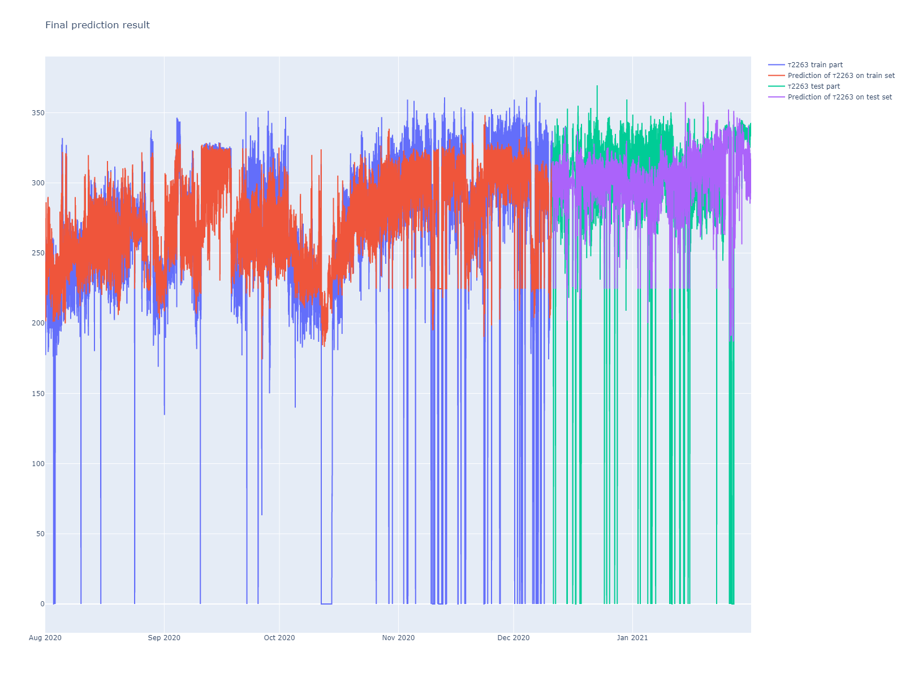
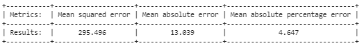

# Regression_test_task

## Usage
1. Open Jupyter Notebook for Colab and then push the button **Open in Colab**.
2. Run all cells.

**Note:** for local usage, you should download the repository and set all dependencies on your own! (There is no file "**requirements.txt**")

## Data
Data is available for one of the four boilers of the thermal power plant. The boiler consumes blast furnace and natural gas; there are two inputs - left and right for each gas. The readings of some flow sensors may be inaccurate.

## The task
1.	Implement data pre-processing;
2.	Conduct primary data analysis;
3.	Develop a forecasting  model for the amount of steam from boiler # 1 (code т2263);
4.	Justify the model.
5.	Provide the results as an ipython-notebook with explanations.

## Results
Here is the result on Regression task:
**Note:** outliers included.

### Metrics

